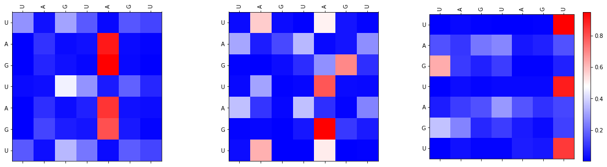
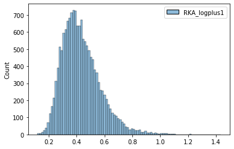
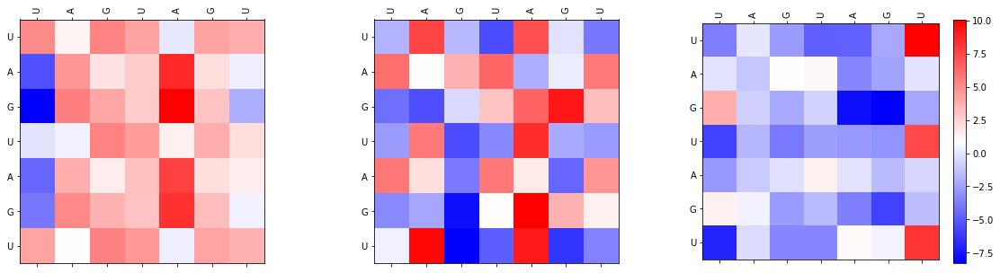
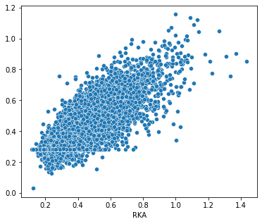
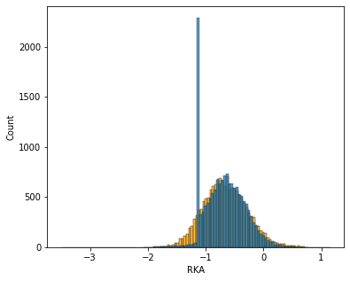

# Apply Encoder of Transformer Model (Self Attention) to Explore RNA-Protein Binding

## Purpose
Transformer models are cutting edge nature language processing models and have been applied in different field. Here I showed how to use the encoder of transformer model to visualize the RNA/DNA - protein interaction of individual sequence and which interactions I need to pay attention on. Here I provide the prototype of this method and hope this might help your researh and product.

The prototype in jupyter notebook form is [here](Transformer-RNA.ipynb) 

Here is the attention matrix for the demo sequence, **UAGUAGU**.


## Issues
There are still potential issues.

1. The sample size is still not enough to prevent over fitting even though I have shrink the size of the model. Maybe we can train it like how people trained GPT or ELMO models then twick it.
2. Choose proper loss functions. We might be able to use more targets not only *K<sub>a<sub>* s to train the model. When we switch to other targets like MFE, we might use another loss function. In this prototype [Mean Absolute Error (MAE)](https://www.tensorflow.org/api_docs/python/tf/keras/losses/MeanAbsoluteError) is used.
3. Usually training 50 epochs is sufficient.
4. If you are using MAC like me, here is how to accelerate your training by tensorflow-metal. You can find useful information [here](https://developer.apple.com/metal/tensorflow-plugin/)

## Package requirement
- pandas
- tensorflow (2.x)
- tensorflow_addons
- numpy
- matplotlib
- seaborn
- scikit-learn
- datetime


## Data preparation
You can use the real demo data called [Result_Structure.csv](Result_Structure.csv), and the data looks as follows:

```python
df_preprocess = pd.read_csv("Result_Structure.csv")
df = df_preprocess[df_preprocess["Qc"]!=1]
df.head()
```


<div>
<style scoped>
    .dataframe tbody tr th:only-of-type {
        vertical-align: middle;
    }

    .dataframe tbody tr th {
        vertical-align: top;
    }

    .dataframe thead th {
        text-align: right;
    }
</style>
<table border="1" class="dataframe">
  <thead>
    <tr style="text-align: right;">
      <th></th>
      <th>Sequence</th>
      <th>Structure</th>
      <th>MFE</th>
      <th>K</th>
      <th>KA</th>
      <th>RKA</th>
      <th>Qc</th>
      <th>sevenMer</th>
    </tr>
  </thead>
  <tbody>
    <tr>
      <th>0</th>
      <td>GGAUCCAUUCAAAAAAAGAACGGAUCC</td>
      <td>((((((.(((.......))).))))))</td>
      <td>-10.5</td>
      <td>4.971544</td>
      <td>0.201145</td>
      <td>0.395847</td>
      <td>0</td>
      <td>AAAAAAA</td>
    </tr>
    <tr>
      <th>1</th>
      <td>GGAUCCAUUCAAAAAACGAACGGAUCC</td>
      <td>((((((.(((.......))).))))))</td>
      <td>-10.5</td>
      <td>4.514383</td>
      <td>0.221514</td>
      <td>0.435934</td>
      <td>0</td>
      <td>AAAAAAC</td>
    </tr>
    <tr>
      <th>2</th>
      <td>GGAUCCAUUCAAAAAAGGAACGGAUCC</td>
      <td>((((((.(((.......))).))))))</td>
      <td>-10.4</td>
      <td>3.609146</td>
      <td>0.277074</td>
      <td>0.545273</td>
      <td>0</td>
      <td>AAAAAAG</td>
    </tr>
    <tr>
      <th>3</th>
      <td>GGAUCCAUUCAAAAAAUGAACGGAUCC</td>
      <td>((((((.((((.....)))).))))))</td>
      <td>-11.7</td>
      <td>6.607685</td>
      <td>0.151339</td>
      <td>0.297831</td>
      <td>0</td>
      <td>AAAAAAU</td>
    </tr>
    <tr>
      <th>4</th>
      <td>GGAUCCAUUCAAAAACAGAACGGAUCC</td>
      <td>((((((.(((.......))).))))))</td>
      <td>-10.5</td>
      <td>3.221327</td>
      <td>0.310431</td>
      <td>0.610919</td>
      <td>0</td>
      <td>AAAAACA</td>
    </tr>
  </tbody>
</table>
</div>


## Set Hyperparameters
There are several hyperparameters can be set to optimize the model.

- seq_length: The length of your input sequence.
- num_layers: Nunmber of encoding layers in your model. I used 1.
- d_model: This is for word embedding.
- num_heads: How many heads for your multi-head attention part. Somehow we can see RNA/DNA sequences as sentenses. One nucleotide may have multiple way to interprete. Therefore application of multi-head attention can help us explain the rules and I would think it might be better than PWM+IC model.
- dff: Another hyperparameter
 
```python
seq_length=7
num_layers=1
d_model=21
num_heads=3
dff=64
```
## Use seaborn to visualize the distribution of binding constants
Here is a trick! If the data distribution is skew, you might be able to use log(1+x) to normalize it. 

```python
sns.histplot(df[["RKA_logplus1"]])
```

    

    
## Visualize attentions for individual sequence
### Visualize qkv

```
    head0: 10.08450698852539
    head0: -17.92645263671875
    head1: 6.653016567230225
    head1: -9.913814544677734
    head2: 10.091736793518066
    head2: -8.309465408325195
    sequence:  ['U A G U A G U']
    predicted RKA: 0.63470059633255, real RKA 13003    0.782336
    Name: RKA_logplus1, dtype: float64
```


    

    

### Visualize attention matrix

```
    head0: 0.8808605074882507
    head0: 2.2231404727790505e-05
    head1: 0.8084603548049927
    head1: 0.0011402004165574908
    head2: 0.9505181908607483
    head2: 0.0026911089662462473
    sequence:  ['U A G U A G U']
    predicted RKA: 0.63470059633255, real RKA 13003    0.782336
    Name: RKA_logplus1, dtype: float64
```

    


## Verify the predicted result

```python
plt.rcParams["figure.figsize"] = (6,5)
sns.scatterplot(np.log(1+df.RKA), np.log(np.exp(result)))
```    

    
## Calculate *R<sup>2<sup>*

```python 
from sklearn.metrics import r2_score
r2_score(np.log(1+df.RKA), result)
```


    0.6460414733738298


## Compare the distributions of real/predicted data

```python
sns.histplot(np.log(df.RKA), color = "orange")
sns.histplot(np.log(np.exp(result)-1))

```
    

    

